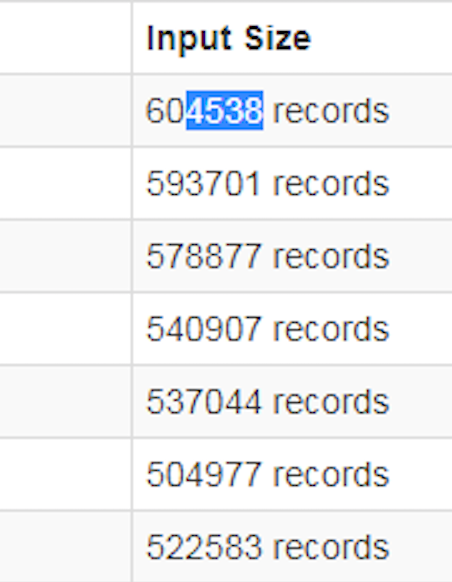
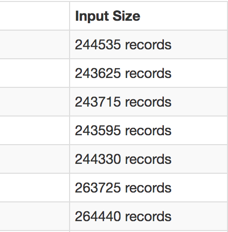

## spark streaming应用在经历实际大数据时出现的问题

### 场景1 
> 如果不对应用进行限速设置，一般遇到数据洪流的时候，应用会出现一个或者多个的超大*batch*。
导致的结果就是应用一直会去处理这个（或者多个）超大的*batch*，而随后的*batch*延时处理。

解决方案：
```
  一般采用背压（backpressure）和限制每个分区的速度的方式对*spark streaming*应用进行限速
  spark.streaming.backpressure.enabled:true
  spark.streaming.kafka.maxRatePerPartition:n (record/s)
```

处理效果对比:

限速之前的*batch*:



限速之后的*batch*:



### 场景2
> 增加应用的资源(number.executors,executor.cores)，但是应用的每个批次(*batch*)的处理时间反而没有减少，
还有个现象是应用没有能充分使用executor（例如应用本身占有120个executor，但是最多只能使用50个executor。）

解决方案:
```
  每个spark streaming应用的每个批次(*batch*)处于**活动**状态的*Task*数量取决于RDD的*partition*数量,不提高应用的分区数是无法提高
  任务的并行度，继而无法充分使用扩充的资源(*number.executor*).比较推荐的解决方案是增加数据源的分区数。
```
处理效果对比：


