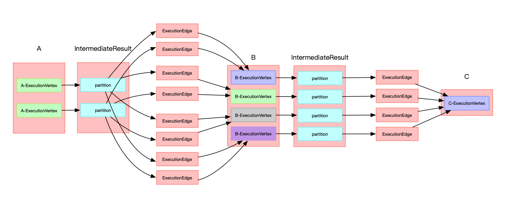

## ExecuteGraph的生成流程

在客户端构建完StreamGraph和JobGraph后，客户端通过HTTP的方式给YARN App Master发送JobGraph和用户代码信息（user-jar）。YARN App Master接收到信息后转交给JobManager处理，然后JobManager根据JobGraph开始构建ExecuteGraph。
```java
JobMaster line:204
public JobMaster(...) {
    ...
    this.executionGraph = createAndRestoreExecutionGraph(jobManagerJobMetricGroup);
    ...
}
```
在JobMaster的构造函数里面就开始构建ExecuteGraph了，下面我们具体看一下`createAndRestoreExecutionGraph(...)`方法
```java
JobMaster line:1134
	private ExecutionGraph createAndRestoreExecutionGraph(JobManagerJobMetricGroup currentJobManagerJobMetricGroup) throws Exception {

        // 构建ExecuteGraph
		ExecutionGraph newExecutionGraph = createExecutionGraph(currentJobManagerJobMetricGroup);

		final CheckpointCoordinator checkpointCoordinator = newExecutionGraph.getCheckpointCoordinator();

		if (checkpointCoordinator != null) {
			// check whether we find a valid checkpoint
			if (!checkpointCoordinator.restoreLatestCheckpointedState(
				newExecutionGraph.getAllVertices(),
				false,
				false)) {

				// check whether we can restore from a savepoint
				tryRestoreExecutionGraphFromSavepoint(newExecutionGraph, jobGraph.getSavepointRestoreSettings());
			}
		}

		return newExecutionGraph;
	}
```
而ExecuteGraph的具体构建是由ExecutionGraphBuilder类完成的,通过buildGraph(...)方法进行构建
```java
ExecutionGraphBuilder line:234

public static ExecutionGraph buildGraph(...) {
    ...
    // 构建ExecuteGraph的核心方法
    executionGraph.attachJobGraph(sortedTopology);
    ...
}
```
在ExecuteGraph.attachJobGraph(...)里面的实际逻辑可以总结为下面几点：
1. 由JobVertex构建ExecutionJobVertex，其中ExecutionJobVertex是包含JobVertex和ExecutionVertex数组
2. 然后将每个ExecutionVertex关联上它的前置节点

下面我们分别具体看一下这两点
```java
ExecuteGraph line:811

public void attachJobGraph(List<JobVertex> topologiallySorted) throws JobException {

		LOG.debug("Attaching {} topologically sorted vertices to existing job graph with {} " +
				"vertices and {} intermediate results.",
				topologiallySorted.size(), tasks.size(), intermediateResults.size());

		final ArrayList<ExecutionJobVertex> newExecJobVertices = new ArrayList<>(topologiallySorted.size());
		final long createTimestamp = System.currentTimeMillis();

		for (JobVertex jobVertex : topologiallySorted) {

			if (jobVertex.isInputVertex() && !jobVertex.isStoppable()) {
				this.isStoppable = false;
			}

			//1 构建ExecuteJobVertex节点
			ExecutionJobVertex ejv = new ExecutionJobVertex(
				this,
				jobVertex,
				1,
				rpcTimeout,
				globalModVersion,
				createTimestamp);

			//2 连接前节点
			ejv.connectToPredecessors(this.intermediateResults);

			ExecutionJobVertex previousTask = this.tasks.putIfAbsent(jobVertex.getID(), ejv);
			if (previousTask != null) {
				throw new JobException(String.format("Encountered two job vertices with ID %s : previous=[%s] / new=[%s]",
						jobVertex.getID(), ejv, previousTask));
			}

			//3  获取中间结果节点，并存放在intermediateResults容器里
			for (IntermediateResult res : ejv.getProducedDataSets()) {
				IntermediateResult previousDataSet = this.intermediateResults.putIfAbsent(res.getId(), res);
				if (previousDataSet != null) {
					throw new JobException(String.format("Encountered two intermediate data set with ID %s : previous=[%s] / new=[%s]",
							res.getId(), res, previousDataSet));
				}
			}

			this.verticesInCreationOrder.add(ejv);
			this.numVerticesTotal += ejv.getParallelism();
			newExecJobVertices.add(ejv);
		}
```
在第1步骤里面就开始构建ExecutionJobVertex，这个ExecutionJobVertex包含的信息比较多，例如ExecuteGraph、JobVertex、并行度parallelism，还有JobVertex的输入inputs以及ExecutionVertex数组。
构建出了ExecutionVertex，那剩下的问题就是如何将ExecutionVertex连接起来，这一操作在第2步骤完成
```java
ExecutionJobVertex line:427

	public void connectToPredecessors(Map<IntermediateDataSetID, IntermediateResult> intermediateDataSets) throws JobException {

		List<JobEdge> inputs = jobVertex.getInputs();
        ...
		for (int num = 0; num < inputs.size(); num++) {
			JobEdge edge = inputs.get(num);
		    ...
			IntermediateResult ires = intermediateDataSets.get(edge.getSourceId());
			if (ires == null) {
				throw new JobException("Cannot connect this job graph to the previous graph. No previous intermediate result found for ID "
						+ edge.getSourceId());
			}

			this.inputs.add(ires);

			int consumerIndex = ires.registerConsumer();

			// 将执行节点的每个subTask都连接到前节点
			for (int i = 0; i < parallelism; i++) {
				ExecutionVertex ev = taskVertices[i];
				ev.connectSource(num, ires, edge, consumerIndex);
			}
		}
	}
	
```
在第2步骤的连接前置节点的逻辑可以总结为：`对于每个输入节点，当前节点都会遍历所有的ExecuetionVertex（对应当前节点的并行度），然后每个ExecutionVertex去连接它的上游.` 下面便是每个ExecutionVertex连接上游的具体逻辑：

```java
ExecutionVertex line:346

	public void connectSource(int inputNumber, IntermediateResult source, JobEdge edge, int consumerNumber) {

		final DistributionPattern pattern = edge.getDistributionPattern();
		final IntermediateResultPartition[] sourcePartitions = source.getPartitions();

		ExecutionEdge[] edges;

		switch (pattern) {
			case POINTWISE:
				edges = connectPointwise(sourcePartitions, inputNumber);
				break;

			case ALL_TO_ALL:
				edges = connectAllToAll(sourcePartitions, inputNumber);
				break;

			default:
				throw new RuntimeException("Unrecognized distribution pattern.");

		}

		this.inputEdges[inputNumber] = edges;

		for (ExecutionEdge ee : edges) {
			ee.getSource().addConsumer(ee, consumerNumber);
		}
	}
```
```java
ExecutionVertex line:377

	private ExecutionEdge[] connectAllToAll(IntermediateResultPartition[] sourcePartitions, int inputNumber) {
		ExecutionEdge[] edges = new ExecutionEdge[sourcePartitions.length];

		for (int i = 0; i < sourcePartitions.length; i++) {
			IntermediateResultPartition irp = sourcePartitions[i];
			edges[i] = new ExecutionEdge(irp, this, inputNumber);
		}

		return edges;
	}
```

一般分发的模式是`ALL_TO_ALL`,所以执行节点的连接上游的方式是遍历每个上游的分区，并将每个分区连接到当前的执行节点上（ExecutionVertex）。到此，ExecutionGraph就全部构建完成。

最后，举个🌰，如果我们的业务逻辑的计算DAG是这样的A(2) -> B(4) -> C(1)，那它对应的ExecutionGraph将会是什么样的？

