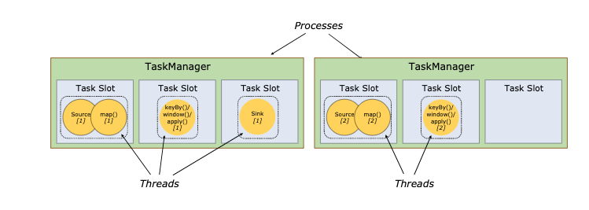
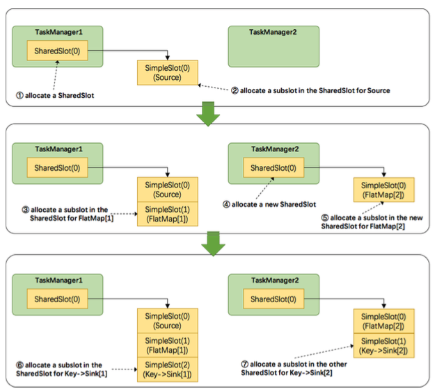

## 计算资源的调度
每个worker(TaskManger)是一个JVM进程，并可以在独立的线程里执行一个或者多个subtasks。为了控制每个worker能接收的task数量，就有所谓的task slot(任务槽位)。

每个task slot(任务槽位)代表当前TaskManager的资源的固定一部分。举个例子，一个TaskManager有三个task slot(任务槽位)，将会分配它的1/3的内存资源给每个task slot。slotting资源意味着subtask不会与其他job的subtask竞争内存资源，而是具有一定数量的保留托管内存资源。*注意任务槽位不存在CPU隔离；当前任务槽位只会隔离任务内存*

通过调节任务槽位数量，用户可以定义subtask之间的隔离方式。TaskManager配置成只有一个slot意味着每个task group运行在一个单独的JVM进程里；TaskManager配置成多个slot意味着多个subtasks共享一个JVM。在同一JVM里面的tasks共享TCP连接（基于多路复用）和心跳信息。这些tasks同样可以共享数据集合和数据结构，因此可以减少每个task的负载。

默认情况下，Flink支持subtask共享slots，即使他们不是task的subtask，只要他们来自相同的job。因此，一个slot可以包含整个job的数据处理流程（entire pipline）。此外，允许slot sharing(槽位共享)有两大益处：

  - 槽位共享时，Flink集群不需要计算整个job的所有子任务数，而是直接计算job的最高并行度即可
  - 更容易的有效使用资源。如果没有槽位共享时，轻量级的subtask(source/map)会占用重量级的subtask(window/join)一样的内存资源，资源得不到合理的分配；使用槽位共享，通过增加基础的并行度可以利用资源，可以将重量级的subtask公平地分布到TaskManagers上

接下来我们看看Flink是如何共享slot的，如下图所示：

  - TaskManager1分配一个SharedSlot0;
  - 把source subtask放入一个SimpleSlot0，再把该slot放入SharedSlot0;
  - 把flatmap subtask放入一个SimpleSlot1，再把该slot放入SharedSlot0;
  - 由于flatmap task并行度是2，因此不能把它的subtask放入SharedSlot0，所以向TaskManager2申请了一个新的SharedSlot0;
  - 把第二个flatmap subtask放入一个新的SimpleSlot，并放入TaskManager2的SharedSlot0;
  - 最后处理key&sink task，因为其并行度是2，所以先把第一个subtask放入TaskManager1的SharedSlot0，把第二个key&sink subtask放入TaskManager2的SharedSlot。

资料参考：
  - https://cloud.tencent.com/developer/article/1172583
  - https://ci.apache.org/projects/flink/flink-docs-release-1.8/concepts/runtime.html
