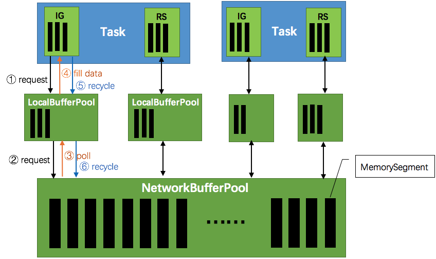
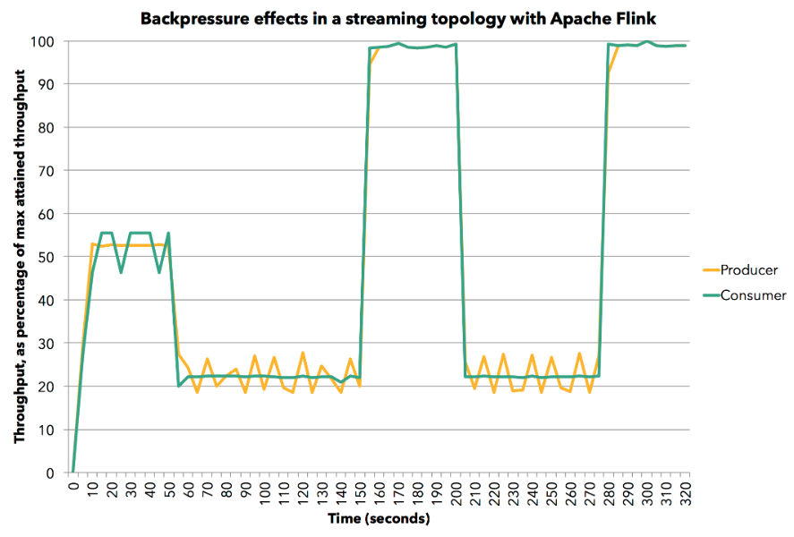
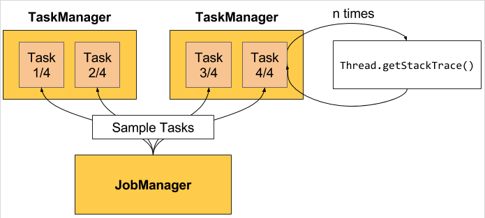

## Flink的背压原理

### 背压的使用场景
背压通常产生于这样的场景：短时负载高峰导致系统接收数据的速率远高于它处理数据的速率。举个例子，垃圾回收停顿可能导致流入的数据快速堆积，或者遇到大促或者秒杀活动导致流量陡增。注意，背压如果不能得到正确的处理，可能会导致资源耗尽甚至系统崩溃。

### Flink中的背压
Flink是怎么处理背压的呢？答案是：Flink没有使用任何复杂的机制来解决背压问题，因为Flink利用自身作为纯数据流引擎的优势来优雅地响应背压问题。下面我们看看Flink是如何在Task之间传输数据的，以及数据流如何实现自然降速的。

Flink在运行时主要由operator和streams两大组件构成。每个operator会消费中间态的流，并在流上进行转换，然后生成新的流。对于Flink的网络机制一种形象的类比是，Flink使用高效有界的分布式阻塞队列，像Java的阻塞队列（BlockingQueue）一样。可以类比生产者消费者模型，使用BlockingQueue的话，一个较慢的消费者会降低生产者的生成速率，因为一旦队列（有界队列）满了，生产者会被阻塞。Flink解决背压的方案类似生产者消费者模型。

在Flink中，这些分布式阻塞队列就是这些逻辑流，而队列容量是通过缓冲池（LocalBufferPool）来实现的。每个被生产和被消费的流都会被分配一个缓冲池。缓冲池管理着一组缓冲（Buffer），缓冲在被消费后可以被循环利用。

#### 网络传输中的内存管理
下图展示了Flink在网络传输场景下的内存管理。网络上传输的数据会写到Task的InputGate(IG)中，经过Task的逻辑处理后，再由Task写到ResultPartition（RS）中。每个Task都包含了输入和输出，输入和输出的数据存在Buffer中（都是字节数据）。Buffer是MemorySegment的包装类。



  1. TaskManager(TM)在启动时，会先初始化NetworkEnvironment对象，TM中所有与网络相关的东西都会由该类来管理（如Netty连接），其中就包括NetworkBufferPool。根据配置，Flink会在NetworkBufferPool中生成一定数量（默认2048）的内存块MemorySegment，内存块的总数量就代表了网络传输中所有可能的内存。NetworkEnvironment和NetworkBufferPool是Task之间共享的，每个TM只会实例化一个。
  2. Task线程启动时，会向NetworkEnvironment注册，NetworkEnvironment会为Task的InputGate(IG)和ResultPartition(RP)分别创建一个LocalBufferPool（缓冲池）并设置可申请的MemorySegment（内存块）数量。IG 对应的缓冲池初始的内存块数量与 IG 中 InputChannel 数量一致，RP 对应的缓冲池初始的内存块数量与 RP 中的 ResultSubpartition 数量一致。不过，每当创建或销毁缓冲池时，NetworkBufferPool 会计算剩余空闲的内存块数量，并平均分配给已创建的缓冲池。注意，这个过程只是指定了缓冲池所能使用的内存块数量，并没有真正分配内存块，只有当需要时才分配。为什么要动态地为缓冲池扩容呢？因为内存越多，意味着系统可以更轻松地应对瞬时压力（如GC），不会频繁地进入反压状态，所以我们要利用起那部分闲置的内存块。
  3. 在Task线程执行过程中，当Netty接收端收到数据时，为了将Netty中的数据拷贝到Task中，InputChannel（实际上是RemoteInputChannel）会向其对应的缓存池申请内存块（上图的①）。如果缓冲池中也没有可用的内存块且已申请的数量还没到池子上限，则会向 NetworkBufferPool 申请内存块（上图中的②）并交给 InputChannel 填上数据（上图中的③和④）。*如果缓冲池已申请的数量达到上限了呢？或者 NetworkBufferPool 也没有可用内存块了呢？这时候，Task 的 Netty Channel 会暂停读取，上游的发送端会立即响应停止发送，拓扑会进入反压状态。当 Task 线程写数据到 ResultPartition 时，也会向缓冲池请求内存块，如果没有可用内存块时，会阻塞在请求内存块的地方，达到暂停写入的目的。*
  4. 当一个内存块被消费完成之后（在输入端是指内存块中的字节被反序列化成对象了，在输出端是指内存块中的字节写入到 Netty Channel 了），会调用 Buffer.recycle() 方法，会将内存块还给 LocalBufferPool （上图中的⑤）。如果LocalBufferPool中当前申请的数量超过了池子容量（由于上文提到的动态容量，由于新注册的 Task 导致该池子容量变小），则LocalBufferPool会将该内存块回收给 NetworkBufferPool（上图中的⑥）。如果没超过池子容量，则会继续留在池子中，减少反复申请的开销。
  
#### 背压的过程

下图简单展示了两个Task之间的数据传输以及Flink如何感知到背压


说明：
  - 记录“A”进入Flink并且被Task1处理（其实这个过程还包含了Netty接收、反序列化等过程）；
  - 记录被序列化到buffer中；
  - 该buffer被发送到Task2，然后Task2从这个buffer中读取记录。
  
注意：*记录能被 Flink 处理的前提是，必须有空闲可用的 Buffer。*

结合上面两张图看：Task1在输出端有个相关的LocalBufferPool（称为缓存池1），Task2在输入端也有一个相关的LocalBufferPool（称为缓冲池2）。如果缓冲池1中有空闲的buffer来序列化记录“A”，Flink就系列化记录并发送该buffer。

这里有两种场景：
  - 本地传输：如果Task1和Task2运行在同一个TaskManager，该buffer可以直接交给下一个Task。一旦Task2消费了该buffer，则该buffer会被缓冲池1回收。如果Task2的速度比Task1的速度慢，那么buffer回收的速度就会赶不上Task1取buffer的速度，导致缓冲池1无可用的buffer，Task1等待在可用的buffer上。最终形成Task1的降速。
  - 远程传输：如果Task1和Task2运行在不同的TaskManger上，那么buffer会发送到网络（TCP Channel）后被回收。在接收端，会从LocalBufferPool中申请buffer，然后拷贝网络中的数据到buffer中。如果没有可用的buffer，会停止从TCP连接中读取数据。在输出端，通过Netty的水位值机制保证不往网络中写入太多数据。如果网络中的数据（Netty输出缓冲中的字节数）超过了高水位值，我们会等到其降到低水位值以下才继续写入数据。这保证了网络中不会有太多的数据。*如果接收端停止消费网络中的数据（由于接收端缓冲池没有可用 buffer），网络中的缓冲数据就会堆积，那么发送端也会暂停发送。另外，这会使得发送端的缓冲池得不到回收，writer 阻塞在向 LocalBufferPool 请求 buffer，阻塞了 writer 往 ResultSubPartition 写数据。*
  
总结：这种固定大小缓冲池就像阻塞队列一样，保证了 Flink 有一套健壮的反压机制，使得 Task 生产数据的速度不会快于消费的速度。我们上面描述的这个方案可以从两个 Task 之间的数据传输自然地扩展到更复杂的 pipeline 中，保证反压机制可以扩散到整个 pipeline。 

#### 背压实验

在Flink的官方博客中为了展示Flink的背压效果，做了一个小实验。下面这张图显示了：随着时间的改变，生产者（黄色线）和消费者（绿色线）每5秒的平均吞吐与最大吞吐（在单一JVM中每秒达到8百万条记录）的百分比。我们通过衡量task每5秒钟处理的记录数来衡量平均吞吐。该实验运行在单 JVM 中，不过使用了完整的 Flink 功能栈。



首先，我们运行生产task到它最大生产速度的60%（我们通过Thread.sleep()来模拟降速）。消费者以同样的速度处理数据。然后，我们将消费task的速度降至其最高速度的30%。你就会看到背压问题产生了，正如我们所见，生产者的速度也自然降至其最高速度的30%。接着，停止消费task的人为降速，之后生产者和消费者task都达到了其最大的吞吐。接下来，我们再次将消费者的速度降至30%，pipeline给出了立即响应：生产者的速度也被自动降至30%。最后，我们再次停止限速，两个task也再次恢复100%的速度。总而言之，我们可以看到：生产者和消费者在 pipeline 中的处理都在跟随彼此的吞吐而进行适当的调整，这就是我们希望看到的反压的效果。


### Flink的背压监控
Flink 在这里使用了一个 trick 来实现对反压的监控。如果一个 Task 因为反压而降速了，那么它会卡在向 LocalBufferPool 申请内存块上。那么这时候，该 Task 的 stack trace 就会长下面这样：

```java
java.lang.Object.wait(Native Method)
o.a.f.[...].LocalBufferPool.requestBuffer(LocalBufferPool.java:163)
o.a.f.[...].LocalBufferPool.requestBufferBlocking(LocalBufferPool.java:133) <--- BLOCKING request
[...]
```
那么事情就简单了。通过不断地采样每个 task 的 stack trace 就可以实现反压监控。



Flink 的实现中，只有当 Web 页面切换到某个 Job 的 Backpressure 页面，才会对这个 Job 触发反压检测，因为反压检测还是挺昂贵的。JobManager 会通过 Akka 给每个 TaskManager 发送TriggerStackTraceSample消息。默认情况下，TaskManager 会触发100次 stack trace 采样，每次间隔 50ms（也就是说一次反压检测至少要等待5秒钟）。并将这 100 次采样的结果返回给 JobManager，由 JobManager 来计算反压比率（反压出现的次数/采样的次数），最终展现在 UI 上。UI 刷新的默认周期是一分钟，目的是不对 TaskManager 造成太大的负担。


### 总结
Flink 不需要一种特殊的机制来处理反压，因为 Flink 中的数据传输相当于已经提供了应对反压的机制。因此，Flink 所能获得的最大吞吐量由其 pipeline 中最慢的组件决定。
