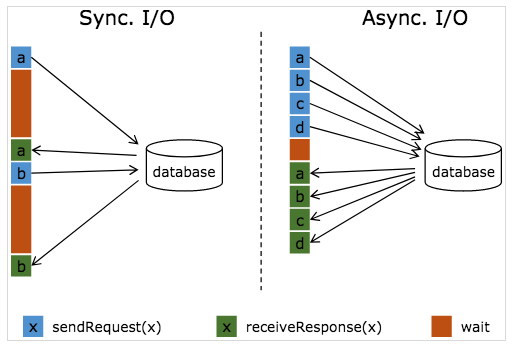

## Flink里面的异步调用：AsyncDataStream

### 背景
Async I/O是一个为了解决Flink与外部系统交互时导致网络延迟问题的非常好的特性

流计算系统中经常需要与外部系统进行交互，比如需要查询外部数据库以关联上用户信息。一般情况下，我们的实现方式是向数据库发送用户a的查询信息，然后等待结果返回，在这之前，我们无法发送用户b的查询请求。这就是一种同步访问的模式，如下图左边所示：

图中棕色的长条表示等待时间，可以发现网络等待时间极大地阻塞了吞吐和延迟。为了解决同步访问的问题，异步模式可以并发地处理多个请求和回复。也就是说，我们可以连续地向数据库发送用户a,b,c,d等的请求，与此同时，哪个请求的回复先返回了就处理哪个回复，从而连续的请求之间不需要阻塞等待，如上图右边所示。这正是Async I/O的实现原理。
